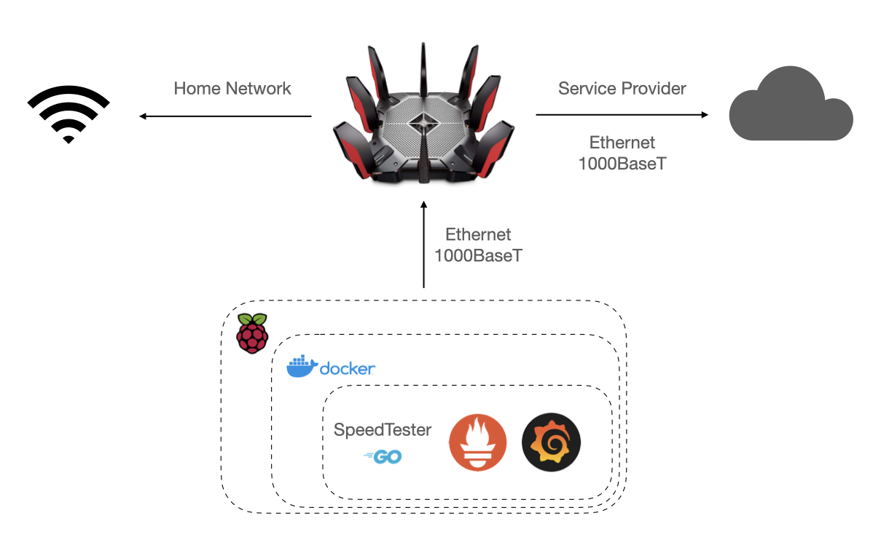

# Internet Speed Tester

A tool based on the [speedtest CLI](https://www.speedtest.net/apps/cli) command to test Internet connection at a given frequency, exposing the results as Prometheus statistics.

With the tool running, you can scrape the metrics with Prometheus and display them in Grafana.

## Build

The following build and publish a Docker Image for x86_64 and ARM (to use Apple Silicon or Raspberry Pi).

```bash
docker buildx create --name local
docker buildx use local
docker buildx build --platform linux/amd64,linux/arm64 -t agalue/speedtester --push .
```

## Run



The provided Docker Compose will start the Speed Tester Tool, Prometheus, and Grafana. Grafana will have a Data Source pointing to Prometheus and a dashboard called "Home Internet" with the statistics.

The proposed architecture involves having a [Raspberry Pi 4](https://www.raspberrypi.org/) running Docker connected to the Wireless Router via Ethernet for better results. We do not recommend connecting via WiFi.

The idea would be to clone this repository within the Pi and follow the instructions to run the applications via Docker Compose.

The data will be stored in local directories from where you checked out the repository. For Prometheus under `data_prometheus` and for Grafana under `data_grafana`.

```bash
mkdir -p data_grafana data_prometheus
chmod 777 data_grafana data_prometheus
docker compose pull
docker compose build
docker compose up -d
```

To use a specific Ookla Server, first retrieve the list of servers:

```bash
➜  speedtest --servers
Closest servers:

    ID  Name                           Location             Country
==============================================================================
 32940  Local Stratus                  Morrisville, NC      United States
 29113  Duke University                Durham, NC           United States
 14734  celitoFiber                    Raleigh, NC          United States
 51030  Wavefly                        Raleigh, NC          United States
 14774  UNC Chapel Hill                Chapel Hill, NC      United States
 48128  Metronet                       Fayetteville, NC     United States
 11814  NeoNova (Randolph Telephone)   Asheboro, NC         United States
 31649  University of North Carolina, Greensboro Greensboro, NC       United States
  5401  Suddenlink Communications LLC  Rocky Mount, NC      United States
 24500  Star Communications, Inc.      Clinton, NC          United States
```

Then, set the `SERVER_ID` variable with the `compose` command:

```bash
SERVER_ID=14774 docker compose up -d
```

If you don't specify the ID, the `speedtest` command will choose one before starting, and because each execution is independent, we cannot guarantee that the selected server will always be the same.

Each metric contains the following labels to provide more context:

* isp
* server_id
* server_name
* server_location

Grafana is available on port 3000 on your Raspberry Pi.
